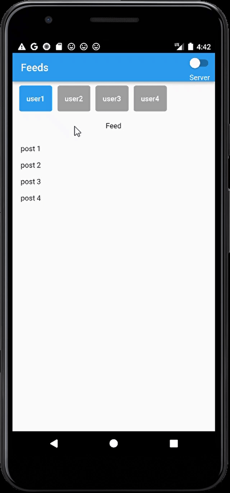
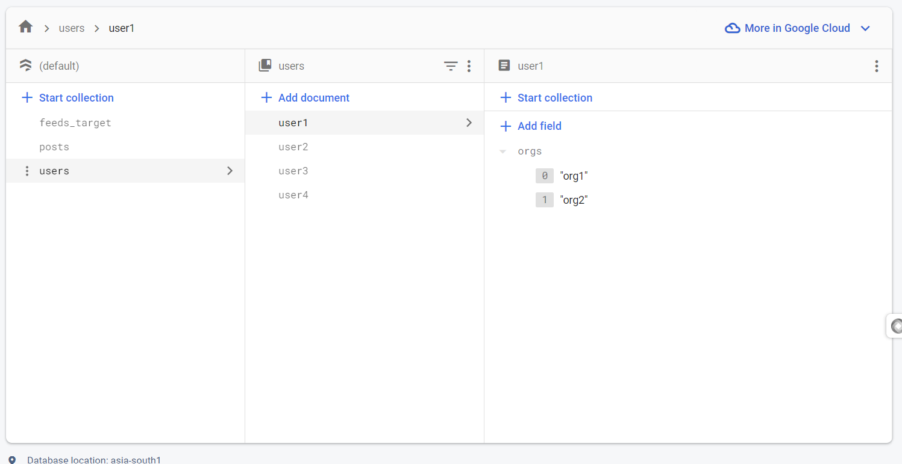
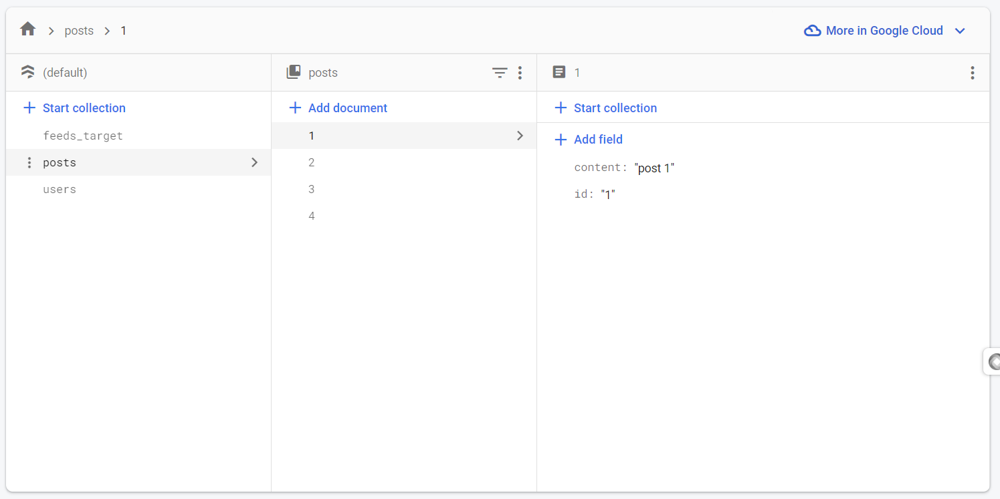
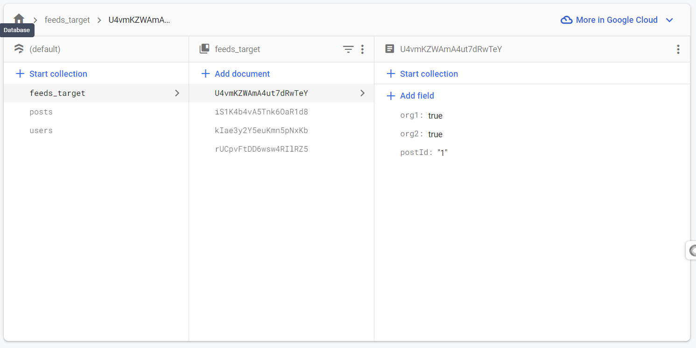

# feeds_espar

Flutter app to show feeds from different organizations (or pages) for different users based on their followings

### Demo

### Firebase (Backend)

#### Users

#### Posts:

#### Feeds Target

Maping between Posts and the Org they are following

